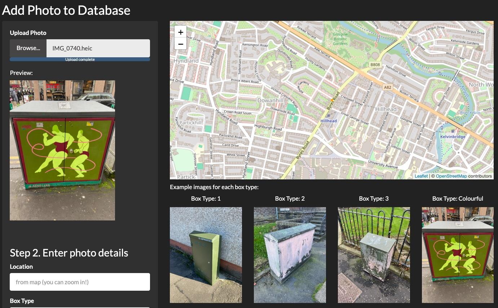
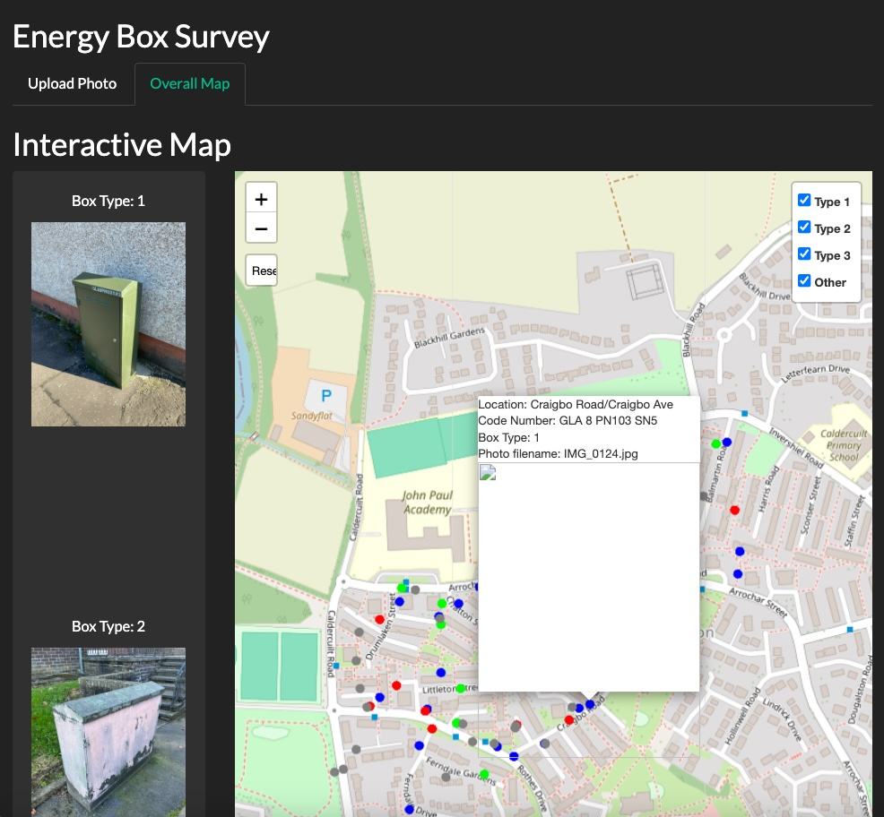

# Energy_box_survey_app

Local community environmental group (Summerston Community Environmental Group, SCEG) wanted the 'energy boxes' in the local area surveying, so I created an app to upload photos of them and catalogue into a database for presentation to the local council to highlight the issue.

This is currently just the upload app, still to come are the collation and presentation pages.

The app won't run on Posit cloud because it needs to use HEIC images to obtain GPS coordinate data and I can't find any way to get Posit to accept them. If anyone knows, or can point me to a cloud environment to run the app, please let me know.

Added overall map with filters to highlight the locations of the different box types. Added in a separate tab so can easily flick between the map and photo uploader. Unfortunately the Leafpop package isn't rendering the the popup images inside the Shiny app as it's an html output, but will update when it has been fixed.

